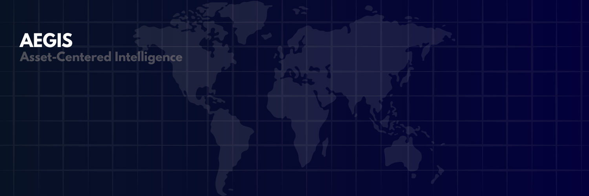

  

  

# Alex Armand-Blumberg

High school student building data-driven systems for geopolitical analysis, escalation monitoring, and infrastructure risk modeling.

Currently focused on geospatial intelligence workflows, multi-source event pipelines, OSINT architecture, and operational risk analysis.

Recipient of the Palantir Valley Forge Grant supporting independent experimentation in geopolitical analysis and intelligence tooling.

---

## Current Project

### AEGIS — Geopolitical Early-Warning & Strategic Intelligence Platform

AEGIS is an asset-centered geopolitical intelligence and escalation monitoring platform designed to analyze global instability, infrastructure exposure, conflict escalation, and emerging strategic risk.

The platform combines:
- Geospatial visualization
- Multi-source intelligence ingestion
- Evidence correlation workflows
- Structured conflict/event analysis
- Analyst-oriented interfaces
- AI-assisted operational reasoning

Current architecture includes:
- Next.js + TypeScript frontend
- Neon/Postgres-backed infrastructure
- Structured event ingestion pipelines
- UCDP integration
- Evidence and corroboration workflows
- Asset-centered exposure analysis
- Experimental analyst AI interfaces

### Focus Areas
- Geopolitical escalation analysis
- Infrastructure and supply chain exposure
- Operational intelligence UX
- Explainable intelligence systems
- Multi-source signal correlation
- Geospatial intelligence tooling

---

## Technical Interests

- Geopolitics
- OSINT
- Geospatial systems
- Intelligence workflows
- Infrastructure risk
- Data engineering
- Network analysis
- Applied AI systems

---

## Tech Stack

- TypeScript
- React / Next.js
- PostgreSQL
- MapLibre / Geospatial tooling
- Vercel
- Python
- Node.js

---

## Current Goals

- Improve event quality and corroboration pipelines
- Expand structured intelligence ingestion
- Build more explainable asset-risk workflows
- Explore operational intelligence interfaces and graph-based analysis

---

## Selected Work

### AEGIS — Geopolitical Early-Warning & Strategic Intelligence Platform
Asset-centered geopolitical monitoring platform focused on escalation analysis, infrastructure exposure, and operational intelligence workflows.

Core areas:
- Multi-source OSINT/event ingestion
- Geospatial intelligence visualization
- Evidence correlation pipelines
- Asset-centered impact analysis
- Experimental analyst interfaces

---

## Links

- AEGIS Platform: https://aegis-hq.com
- AEGIS Repository: https://github.com/alex-armand-blumberg/aegis-web
- LinkedIn: https://www.linkedin.com/in/alexanderbab/

---

> AEGIS is an independent research and engineering project and should not be treated as an authoritative intelligence or forecasting system.
